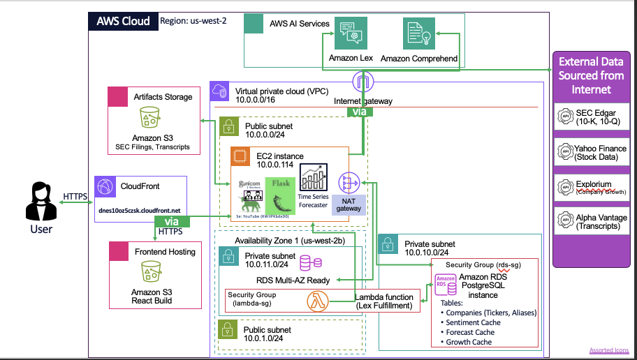

# CyberRisk Dashboard - AWS Deployment
## Created By: Kathleen Hill
### Utilizing Claude Code

This project deploys a CyberRisk Dashboard to AWS using Terraform, with RDS PostgreSQL, EC2/Gunicorn backend, S3/CloudFront frontend, and Amazon Lex chatbot integration.

## Architecture



## AWS Services Used

| Service | Purpose | Assessment Category |
|---------|---------|-------------------|
| **Amazon Comprehend** | NLP sentiment analysis | AI Service #1 |
| **Amazon Lex V2** | Chatbot assistant | AI Service #2 |
| **RDS PostgreSQL** | Relational database | Database |
| **EC2 + Gunicorn** | Flask API backend | Application Deployment |
| **S3 + CloudFront** | React frontend hosting | Application Deployment |
| **Lambda** | Lex fulfillment handler | Serverless |
| **VPC** | Network isolation | Security |
| **IAM** | Role-based access | Security |

## Prerequisites

1. AWS CLI configured with `class` profile
2. Terraform >= 1.0.0
3. Python 3.11+
4. Node.js 18+ (for React build)
5. SSH key pair for EC2 access

## Quick Start

### 1. Configure Terraform Variables

```bash
cd terraform
cp terraform.tfvars

```

Required variables:
- `db_password` - PostgreSQL password
- `ec2_key_name` - Your SSH key name in AWS
- `source_s3_bucket` - Source bucket for migration (cyber-risk profile)

### 2. Initialize and Deploy Infrastructure

```bash
# Initialize Terraform
terraform init

# Plan deployment
terraform plan

# Apply (creates all resources)
terraform apply
```

### 3. Migrate Data

After Terraform creates the RDS instance:

```bash
cd ../scripts

# Install dependencies
pip install psycopg2-binary boto3

# Run migration
python migrate_data.py \
  --s3-profile cyber-risk \
  --s3-bucket your-source-bucket \
  --db-host $(terraform output -raw rds_endpoint) \
  --db-name cyberrisk \
  --db-user postgres \
  --db-password your-password
```

### 4. Deploy Frontend

```bash
cd ../frontend

# Install dependencies
npm install

# Build for production
npm run build

# Upload to S3
aws s3 sync build/ s3://$(terraform output -raw s3_bucket_name) --profile class

# Invalidate CloudFront cache
aws cloudfront create-invalidation \
  --distribution-id $(terraform output -raw cloudfront_distribution_id) \
  --paths "/*" \
  --profile class
```

### 5. Deploy Backend

The EC2 instance is automatically configured via user_data script. To manually deploy:

```bash
# SSH to EC2
ssh -i ~/.ssh/your-key.pem ec2-user@$(terraform output -raw ec2_public_ip)

# Pull latest code and restart
cd /opt/cyberrisk
git pull
sudo systemctl restart cyberrisk
```

## Project Structure

```
cyber-risk-deploy/
├── terraform/
│   ├── main.tf              # Main configuration
│   ├── variables.tf         # Input variables
│   ├── outputs.tf           # Output values
│   ├── terraform.tfvars     # Variable values (not committed)
│   └── modules/
│       ├── vpc/             # VPC, subnets, NAT
│       ├── rds/             # PostgreSQL database
│       ├── ec2/             # Flask backend instance
│       ├── s3/              # Frontend bucket
│       ├── cloudfront/      # CDN distribution
│       ├── iam/             # Roles and policies
│       └── lex/             # Chatbot configuration
│           └── lambda/      # Lex fulfillment code
├── backend/
│   ├── app.py               # Flask application
│   └── services/
│       ├── lex_service.py   # Lex integration
│       └── ...
├── frontend/
│   └── src/
│       └── components/
│           ├── Dashboard.jsx
│           └── LexChatbot.jsx   # AI Assistant tab
├── scripts/
│   └── migrate_data.py      # S3 to RDS migration
└── README.md
```

## Environment Variables

### Backend (EC2)
```bash
DB_HOST=your-rds-endpoint
DB_NAME=cyberrisk
DB_USER=postgres
DB_PASSWORD=your-password
AWS_REGION=us-east-1
LEX_BOT_ID=from-terraform-output
LEX_BOT_ALIAS_ID=from-terraform-output
```

### Frontend (Build time)
```bash
REACT_APP_API_URL=/api  # CloudFront proxies to EC2
```

## Terraform Outputs

After deployment, get connection info:

```bash
# All outputs
terraform output

# Specific values
terraform output frontend_url
terraform output ssh_command
terraform output rds_endpoint
terraform output lex_bot_id
```

## Dashboard Features

1. **Data Collection** - View SEC filings and earnings transcripts
2. **Price Forecast** - Prophet ML predictions for stock prices
3. **Sentiment Analysis** - AWS Comprehend NLP analysis
4. **Company Growth** - Workforce trends from Explorium
5. **AI Assistant** - Amazon Lex chatbot for navigation help


## Security

- RDS is in private subnets (not publicly accessible)
- EC2 has security group restricting access
- IAM roles follow least-privilege principle
- CloudFront provides HTTPS termination
- Lambda runs in VPC for RDS access

## Cleanup

To destroy all resources:

```bash
cd terraform
terraform destroy
```

**Note:** This will delete all data including the RDS database.

## Troubleshooting

### Lex Bot Not Responding
1. Check Lambda logs in CloudWatch
2. Verify LEX_BOT_ID and LEX_BOT_ALIAS_ID environment variables
3. The fallback service provides responses when Lex is unavailable

### Database Connection Issues
1. Verify security group allows EC2 -> RDS on port 5432
2. Check RDS is in AVAILABLE state
3. Verify credentials in EC2 environment

### CloudFront 504 Errors
1. Check EC2 instance is running
2. Verify Flask/Gunicorn is listening on port 5000
3. Check EC2 security group allows CloudFront origin
